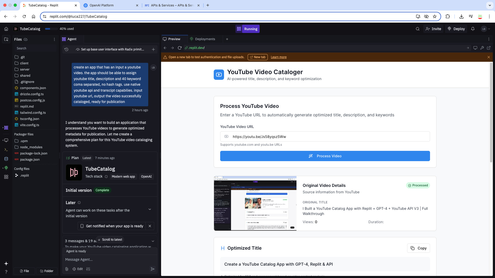

# TubeCatalog 🎬
**AI-powered YouTube Metadata Generator built with Replit Agentic Builder, GPT-4, and YouTube Data API v3**

---

## 🚀 Overview

**TubeCatalog** is an intelligent video cataloging app that automates the creation of YouTube titles, descriptions, and SEO-optimized keywords using OpenAI's GPT-4 and real-time video metadata from the YouTube Data API.

Paste a YouTube URL and the app generates:
- ✅ An SEO-optimized **title**
- ✅ A detailed, AI-generated **description**
- ✅ Exactly **40 comma-separated keywords** (no hashtags)

---

## ✨ Features

- 🔗 Input any YouTube video URL
- 🧠 Extract metadata and auto-generated transcript (if available)
- ✍️ Generate structured, optimized metadata using GPT-4
- 🖼️ Display video preview, thumbnail, and original info
- 📋 One-click copy functionality for all generated content
- 🌐 Built using Replit's **Agentic Builder**, **Tailwind CSS**, and **Radix UI**

---

## 🧱 Tech Stack

- **Frontend**: Radix UI + Tailwind CSS
- **Backend**: Node.js / TypeScript
- **APIs**: 
  - [YouTube Data API v3](https://developers.google.com/youtube/v3)
  - [youtube-transcript](https://www.npmjs.com/package/youtube-transcript)
  - [OpenAI GPT-4](https://platform.openai.com/)
- **Platform**: Replit

---

## 🧑‍💻 Setup Instructions

### 1. Clone the Repository
```bash
git clone https://github.com/lucab85/TubeCatalog.git
cd TubeCatalog
````

### 2. Install Dependencies

```bash
npm install
```

### 3. Create `.env` File

```env
YOUTUBE_API_KEY=your_youtube_api_key
OPENAI_API_KEY=your_openai_api_key
```

### 4. Run the App

```bash
npm run dev
```

---

## 📦 API Keys Required

| Service          | Key               | Use                             |
| ---------------- | ----------------- | ------------------------------- |
| YouTube Data API | `YOUTUBE_API_KEY` | To fetch video metadata         |
| OpenAI API       | `OPENAI_API_KEY`  | To generate content using GPT-4 |

---

## 📷 Screenshot



---

## 🧪 Example Output

For `https://youtu.be/UnWQEJDmego`

* **Title**: *Unlocking AI OCR: Revolutionizing Text Recognition Technology*
* **Description**: *(Full paragraph with use cases and insights from transcript)*
* **Keywords (40)**: `AI OCR, Optical Character Recognition, text recognition, ...`

---

## 📄 License

MIT License © 2025 Luca Berton
[https://lucaberton.com](https://lucaberton.com)

---

## 🙌 Contribute

Pull requests are welcome. For major changes, please open an issue first to discuss what you would like to change.

### 🔗 Links

* 🎬 [Demo Video on YouTube](https://youtu.be/Js58yqsz5Ww) – *See TubeCatalog in action*
* 🌐 [Live App Demo](https://replit.com/@lucaberton/TubeCatalog)
* 📺 [YouTube Channel](https://youtube.com/@lucaberton)
* 🤖 [OpenAI API](https://platform.openai.com/)
* 📘 [YouTube API Docs](https://developers.google.com/youtube/v3)

